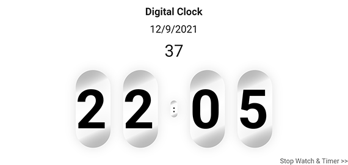
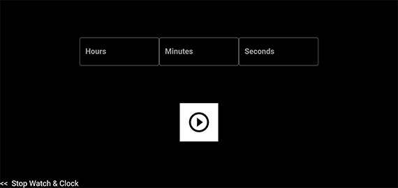

<p align="center">
  <a href="https://github.com/Rohit19060/kings_clock_2" title="King's Clock">
    
  </a>
</p>
<h1 align="center">🌟 King's Clock 🌟</h1>
<p align="center">An app that has Functionality Related to Clock like Timer, Stopwatch</p>

<p align="center">
<a href="https://github.com/Rohit19060/kings_clock_2/blob/master/LICENSE" title="License">

</a>
<a href="https://github.com/Rohit19060/kings_clock_2/fork" title="Forks">

</a>
<a href="https://github.com/Rohit19060/kings_clock_2/stargazers" title="Stars">

</a>
<a href="https://github.com/Rohit19060/kings_clock_2/issues" title="Issues">

</a>
<a href="https://github.com/Rohit19060/kings_clock_2/pulls" title="Pull Requests">

</a>
<a href="https://github.com/Rohit19060/kings_clock_2" title="Repo Size">

</a>
<a href="https://discord.gg/CJU4UNTaFt" title="Join Community">

</a>
<a href="https://open.vscode.dev/Rohit19060/kings_clock_2" title="Open in VSCode">

</a>
<a href="https://github.dev/Rohit19060/kings_clock_2" title="Open in VSCode Web">

</a>
</p>
<p align="center">



</p>

<h2 align="center">🌐 Links 🌐</h2>
<p align="center">
    <a href="https://github.com/Rohit19060/kings_clock_2" title="King's Clock">📂 Repo</a>
    ·
    <a href="https://github.com/Rohit19060/kings_clock_2/issues/new/choose" title="🐛Report Bug/🎊Request Feature">🚀 Got Issue</a>
</p>

## 🚀 Features

- Add Your Own Guide
- Air Tracker
- Awesome UI

## 🛠️ Installation Steps

1. Clone the repository

```Bash
git clone https://github.com/Rohit19060/kings_clock_2.git
```

2. Go into the Project Directory

3. Install dependencies

```Bash
flutter pub get
```

4. Run the app

```Bash
flutter run/Flutter run --release
```

## ❗ Available Commands

1. Install dependencies

```Bash
flutter pub get
```

2. Run the app

```Bash
flutter run/Flutter run --release
```

## 👷 Built with

- Flutter

## 📂 Directory Structure

> [`main.dart`](https://github.com/Rohit19060/kings_clock_2/blob/main/lib/main.dart "Main File"): Main Entry File

## 🎊 Future Updates

## 🧑🏻 Author

**Rohit Jain**

- 🌌 [Profile](https://github.com/Rohit19060 "Rohit Jain")

- 🏮 [Email](mailto:rohitjain19060@gmail.com?subject=Hi%20from%20Save%20You "Hi!")

- 🦁 [Website](https://kingtechnologies.in "Welcome")

<h2 align="center">🤝 Support</h2>

<p align="center">🎀 Contributions (<a href="https://guides.github.com/introduction/flow" title="GitHub flow">GitHub Flow</a>), 🔥 issues, and 🥮 feature requests are most welcome!</p>

<p align="center">💙 If you like this project, Give it a ⭐ and Share it with friends!</p>
<p align="center">💰 Donations Links</p>
<p align="center">
<a href="https://www.paypal.me/kingrohitJ" title="PayPal"></a>
<a href="https://www.buymeacoffee.com/rohitjain" title="Buy me a Coffee"></a>
<a href="https://ko-fi.com/rohitjain" title="Ko-fi"></a>
<a href="https://www.patreon.com/KingTechnologies" title="Patreon"></a>
</p>

<p align="center">Made with Flutter & ❤️ in India</p>
